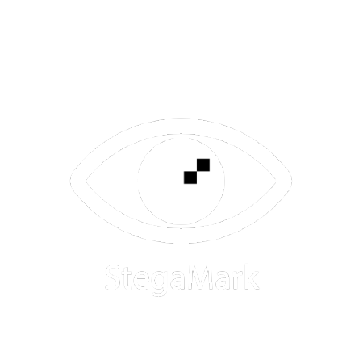

# 🌊 StegaMark Pro v2.1

**An Advanced Image Processing Project for Watermarking & Steganography**

---



StegaMark Pro is a modern web application that demonstrates advanced image processing techniques for both visible and invisible (steganographic) watermarking. With a sleek interface and robust Python backend, it empowers users to protect and analyze images with ease.

---

## 🚀 Try It Live

- **Frontend:** [StegaMark Pro on GitHub Pages](https://goldenahmad.github.io/StegaMark_V2.1/)
- **Backend:** Hosted on PythonAnywhere ([API root](https://0QuQ.pythonanywhere.com))

---

## ✨ Features

- **Visible Watermarking**
  - Add text or logo watermarks
  - Control opacity, position, color, and tiling (Grid, Staggered, Diagonal, Single)
  - Adjustable tile spacing and angle
- **Invisible Watermarking (LSB Steganography)**
  - Hide text messages or small logos within image pixels
  - Adjustable encoding strength (number of LSBs used)
- **Watermark Extraction**
  - Extract hidden data from images watermarked using LSB
- **User-Friendly Web Interface**
  - Live preview for visible watermarks
  - Image upload/download
  - Dark/Light theme toggle
- **Python Backend**
  - Flask server with Pillow (PIL) for image manipulation
  - REST API endpoints: `/watermark`, `/extract`
- **Command Line Interface**
  - Use `app.py` directly for batch or scripted watermarking

---

## 🛠️ How It Works

StegaMark Pro is an image processing system with two main components:

### 1. Frontend
- Built with HTML, CSS (Tailwind), and JavaScript
- Provides an interactive UI for uploading images, configuring watermark options, and viewing results
- Communicates with the backend for all image processing tasks

### 2. Backend
- Python Flask application (`app.py`)
- Handles all watermarking and extraction logic
- Uses Pillow (PIL) for pixel-level image operations
- Hosted live on PythonAnywhere

---

## 📦 Download & Run Locally

**1. Clone the Repository:**
```bash
git clone https://github.com/GoldenAhmad/StegaMark_V2.1.git
cd StegaMark_V2.1
```

**2. Backend (Python Flask Server):**
```bash
python -m venv venv
venv\Scripts\activate  # On Windows
# or
source venv/bin/activate  # On macOS/Linux
pip install -r requirements.txt
python app.py web
```
- The backend will start at `http://127.0.0.1:5000`

**3. Frontend (Web Interface):**
- Open `main.js` and set:
  ```js
  const BACKEND_URL = 'http://127.0.0.1:5000';
  ```
- Open `index.html` in your browser

---

## 🧑‍🔬 Scientific & Technical Highlights

- **Image Processing:**
  - Uses Pillow for watermark blending, tiling, and LSB steganography
  - Supports both visible and invisible watermarking in a single workflow
- **Web Technologies:**
  - Modern, responsive UI with theme support
  - RESTful API design for easy integration
- **Security:**
  - CORS configured for safe cross-origin requests
- **Open Source:**
  - Easily extensible for research or educational purposes

---

## 🖥️ Technologies Used

- **Python 3**, **Flask**, **Pillow (PIL)**
- **HTML5**, **CSS3** (Tailwind), **JavaScript**
- **GitHub Pages** (frontend hosting)
- **PythonAnywhere** (backend hosting)

---

## 📚 License

This project is open source and available under the MIT License.

---

> **Developed by [GoldenAhmad](https://github.com/GoldenAhmad) — 2025**
